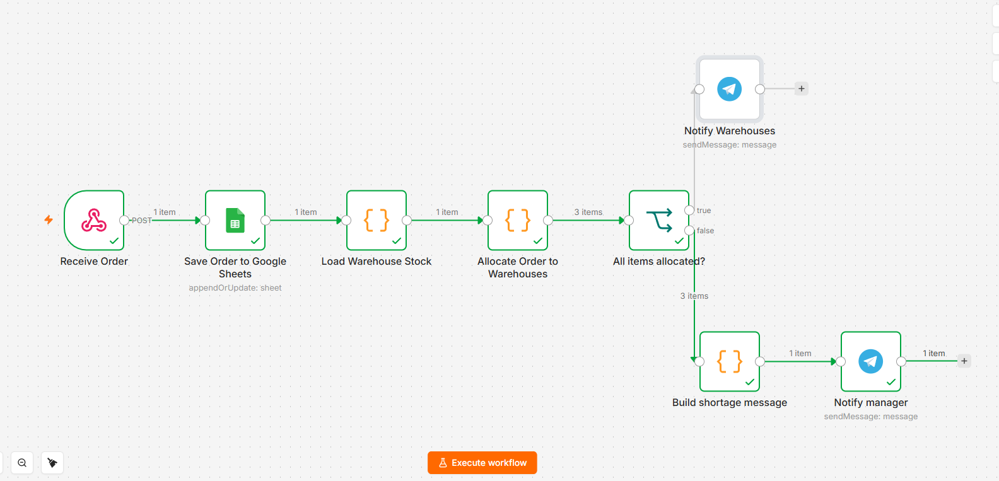

# n8n Order Fulfillment Automation

A portfolio project built in **n8n** that automates order intake, order logging, warehouse stock allocation, and Telegram notifications.

## What the workflow does

1. Receives a new order through an HTTP `POST` webhook.
2. Saves or updates the order in Google Sheets using `Order ID` as the matching key.
3. Loads simulated warehouse stock for Moscow, Kazan, and Novosibirsk.
4. Tries to fulfill the order from the local warehouse first.
5. If one warehouse cannot fulfill the full order, distributes items across multiple warehouses.
6. Checks whether all requested items were allocated.
7. If fulfillment succeeds, sends warehouse-specific Telegram notifications.
8. If stock is insufficient, builds one shortage message and notifies the manager.

## Workflow overview



## Workflow structure

```text
Receive Order
  ↓
Save Order to Google Sheets
  ↓
Load Warehouse Stock
  ↓
Allocate Order to Warehouses
  ↓
All items allocated?
  ├─ true  → Notify Warehouses
  └─ false → Build shortage message → Notify manager
```

## Main business logic

The allocation step:
- checks warehouses in the customer's city first;
- searches all warehouses if the local warehouse cannot fulfill the order;
- if no single warehouse has enough stock, allocates available quantities across multiple warehouses;
- calculates remaining quantities in `missingItems`;
- sets `allItemsAllocated` to determine the success or shortage branch.

## Example outcomes

### Successful allocation

```text
📦 New order for warehouse: Moscow
• iPhone - 5
• Watch - 3
```

### Insufficient stock

```text
❌ Order #1008 cannot be fulfilled completely.

Missing:
• iPhone — 84
```

## Tech used

- n8n
- Webhooks
- JavaScript Code nodes
- Google Sheets
- Telegram Bot API
- JSON
- Conditional branching

## Setup

1. Import `workflow.json` into n8n.
2. Create your own Google Sheets OAuth2 credential and assign it to **Save Order to Google Sheets**.
3. Replace `YOUR_GOOGLE_SHEET_ID` with your spreadsheet ID.
4. Ensure the sheet has these columns:

```text
Order ID
Name
Phone
City
Payment Status
Items
Order Status
Warehouse
Created At
Updated At
Sent to Warehouses At
```

5. Create your own Telegram credential and assign it to both Telegram nodes.
6. Replace `YOUR_TELEGRAM_CHAT_ID` with your own chat ID.
7. Run the workflow in test mode and send `sample-order.json` to the webhook with an HTTP `POST` request.

## Test cases

- `sample-order.json` — normal order that can be allocated.
- `sample-order-shortage.json` — deliberately requests 100 iPhones to trigger the insufficient-stock branch.

## Notes

Warehouse inventory is intentionally stored in a Code node in this portfolio version so the allocation logic is easy to review. In a production system, stock would normally come from a database, ERP, WMS, or external API.

Secrets and personal IDs are **not included** in this repository. Credentials must be configured locally in n8n.

## What this project demonstrates

- API/webhook handling
- data mapping between systems
- idempotent order updates in Google Sheets
- custom JavaScript business logic
- multi-warehouse allocation
- branching and exception handling
- automated Telegram notifications

## Portfolio purpose

This project was built as a practical portfolio case to demonstrate an end-to-end business automation workflow in n8n.

It simulates a real e-commerce order fulfillment process, including order intake, data storage, warehouse allocation, exception handling, and automated notifications.
